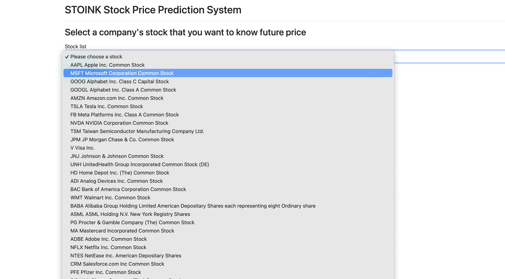

#  ***Stoink***

_Stoink for Stock Price Prediction is a system that uses deep learning LSTM model to predict the price increase or decrease of one or more stocks for the next three months._

## ***Functionality***

_The client aims to present the option of using our model to predict what the increase or decrease in percentage is going to be of a certain stock or multiple stocks._


## ***Datasets*** 
*[AlphaVantage API](https://www.alphavantage.co/)* : AlphaVantage provides data from fundamental data to technical indicators. The system is not only based the learning algorithm on the listing/opening/closing prices, but to go deeper by using the fundamental data provided by AlphaVantage. 
By using the fundamental data of companies we will be able to read data such as what assets the company has and their investments, their inventory and liabilities and the cash flow of the company and the earnings etc. 
The free API version is limited to 5 requests per minute and 500 total per day. 

## ***Libraries***

Numpy, Matplotlib, Tensorflow , Keras , Pandas, Scikit-learn 

## ***Technologies***
 - Python
 - Django
 - Bootstrap3
 - CSS
 - LSTM

## ***Setup***

### ***Run app on localhost***
- 1. Install Anaconda(Recommended)
Install Anaconda that matches your system via [Anaconda webpage](https://www.anaconda.com/products/individual)
Install ML packages either use Anaconda Navigator or conda via terminal: `(base)$ conda install numpy scipy matplotlib scikit-learn pandas `

- 2. Install Django and SQLite
Install pip3 via following command: `(base)$ pip3 install django `

- 3. Run server
Ensure that you are in `client` directory and run the following command: `python manage.py runserver` then open it with Chrome browser: http://127.0.0.1:8000/ Or run `python manage.py runserver 8080`, then open it with Chrome browser: [http://127.0.0.1:8080/](http://127.0.0.1:8080/) if you have ` You're accessing the development server over HTTPS, but it only supports HTTP.` issue with 8000 port.  

### ***Or run app Using Docker***

- 1. Build and run
```Bash
docker build -t <repoName>/<imageName>:<tagName> . # Build image with Tag
docker run -it -p <port:port> <image>:[Tag] # Check if it works
docker tag samgun6/stoink:<Tag> samgun6/stoink:latest # Tag same image with latest
docker push --all-tags samgun6/stoink # Push all tags for selected image to docker hub
```

- 2. Open browser and head to ["http://localhost:8000/"](http://localhost:8000/)


### ***Or run app with kubernetes and minikube***

***Prerequisites***

- 1. _Kubernetes_
- 2. _Minikube_
- 3.  _Docker_

#### Steps:

-  Start fresh with minikube

- 1. Build and push latest docker image
- 2. Start/ reset minikube

```Bash
 minikube delete # Only needed when starting fresh
 minikube start
```

- 3. Apply deployments

```Bash
cd kubernetes
kubectl apply -f stoink-job.yaml
kubectl apply -f stoink-service.yaml
kubectl apply -f stoink-deploy.yaml
```

- Update deployment

- 1. Build and push latest docker image
- 2. Start minikube
```Bash
minikube start
```
  
- 3. Reapply deployment file
  
  ```bash
   kubectl get deployments # Shows current deployment
   kubectl get pods # Shows current pods
   # Change version in stoink-deploy.yaml
   kubectl apply -f stoink-deploy.yaml
   ```

   OR

   ```Bash
   kubectl set image deployment <deployment name> <container name>=<repo/image>:<new tag>
   kubectl set image deployment stoink-deploy stoink=samgun6/stoink:v1.2.0 # Example
   ```

- Run service

  ```Bash
  minikube service stoink-service
  ```

- Check deployment

  ```Bash
  minikube dashboard # In browser

  # or in terminal
  kubectl get pods
  kubectl get deployments
  ```

# Screenshots





